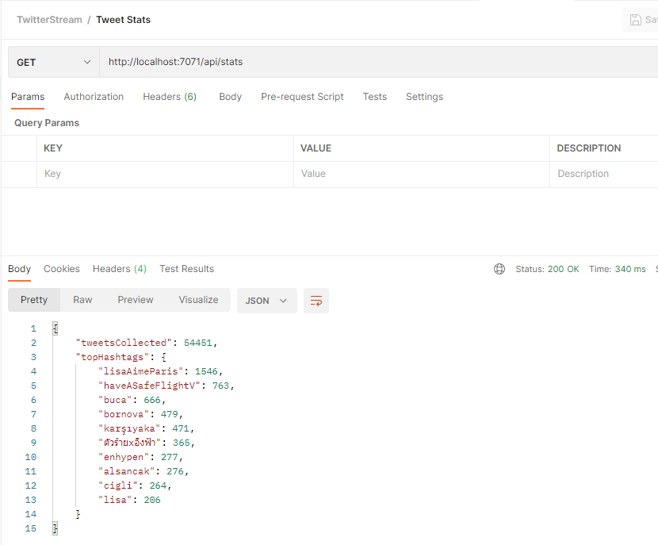

# Overview

Architecturally, this project is split into three parts:

1. A console application that streams tweets from Twitter and puts them onto a queue
1. A listener that takes tweets off the queue and persists them to a database
1. A REST endpoint that returns stats about tweets stored in the database

I opted to split things up like this so the tweet streaming console app had very little responsibility and could focus on queuing tweets as quickly as possible. In turn the queue acts a transient storage. Likewise, the queue listener has very little responsibility: grab tweets off the queue and store them in the database. Finally, the REST endpoint just collects stats from the database. With this separation each component could be run in isolation and scaled independently.

## Code Organization

The solution has several projects.

### Models.Twitter

The `Models.Twitter` project holds models representing objects supplied from the Twitter API

### Setup

The `Setup` project will create database tables and Azure blob storage queues

**Note**: this project assumes the database and the Azure blob storage account already exist

### TwitterStream

The `TwitterStream` project is an Azure Functions project.

This project has an [Azure queue storage trigger](https://docs.microsoft.com/en-us/azure/azure-functions/functions-bindings-storage-queue-trigger?tabs=in-process%2Cextensionv5&pivots=programming-language-csharp) that picks up the tweets from the queue. This function then stores the tweets in a SQL Server database. The database has a very simple structure:

Additionally, the Azure Functions project has an [HTTP trigger](https://docs.microsoft.com/en-us/azure/azure-functions/functions-bindings-http-webhook-trigger?tabs=in-process%2Cfunctionsv2&pivots=programming-language-csharp) that will return statistics about the tweets that have been.

Make a `GET /stats` request like this:

### TwitterStreamConsumerConsole

The `TwitterStreamConsumerConsole` is a simple console application that connects to and starts streaming tweets from Twitter's sample stream. This console application drops each tweet onto an Azure StorageAccount Queue. That's all the console application does.

# Prerequisites

1. SQL Server (I used SQL Server 2019)
1. Visual Studio (I used Visual Studio 2019)
1. [.NET Core 3.1](https://dotnet.microsoft.com/en-us/download/dotnet/3.1)
1. [Azure SDK](https://aka.ms/azsdk/net)
1. [Azure Storage Emulator](https://go.microsoft.com/fwlink/?linkid=717179&clcid=0x409)

# Setup

## Configuration

1. Create a new database in your SQL Server instance named `TwitterStream`
1. Start the Azure Storage Emulator
1. Open the `TwitterStream` solution in Visual Studio
1. Open the `TwitterStreamConsumerConsole` project's `appsettings.json` file and add your Twitter API Bearer Token
1. If you are not using a local SQL service / Azure Storage Emulator you will also need to modify these connection strings per project:
  - `appsettings.json` in the `Setup` project
  - `appsettings.json` in the `TwitterStreamConsumerConsole` project
  - `local.settings.json` in the `TwitterStream` project
1. Restore NuGet packages
1. Build the solution
1. Run the `Setup` project to create database tables and Azure storage queue

## Execution

The `TwitterSteam` Azure Function project stores tweets to the database and provides a REST endpoint to get tweet stats.
The `TwitterStreamConsumerConsole` project is a little console app that tries to continuously stream tweets from the Twitter API.

1. From Visual Studio, run the `TwitterStream` Azure Functions project
1. From a terminal window, run the console app: `dotnet run --project TwitterStreamConsumerConsole`
